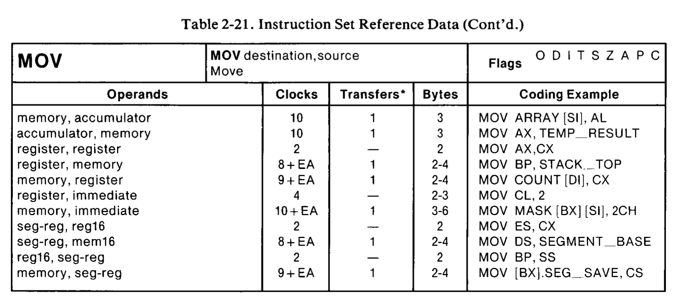

# Performance Aware Programming

Work on the Performance Aware Programming Course by Casey Muratori [computerenhance.com](computerenhance.com).

Part 1

Dissambler for 8086 MOV instructions. See p160+ of the [manual](https://edge.edx.org/c4x/BITSPilani/EEE231/asset/8086_family_Users_Manual_1_.pdf).

Decode
  v
Simulate

Instructions implemented

MOV

|---      |---       |---         |---        |---   |--- |
|100010dw | modregrm | (DISP·LO)  | (DISP·HI) |      | |
|1100011w | mod000rm | (DISP·LO)  | (DISP·HI) | data | data (w=1) |
|1011wreg | data     | data (w=1) |           |      | |
|1010000w | addr-lo  | addr-hi    |           | | |
|1010001w | addr-lo  | addr-hi    |           | | |
|10001110 | mod0SRrm | (DISP·LO)  | (DISP·HI) | | |
|10001100 | mod0SRrm | (DISP·LO)  | (DISP·HI) | | |

ADD
OOOOOOdw modregr/m (DISP-LO) (DISP·HI)
100000sw mod000r/m (DISP-LO) (DISP·HI) data data (sw=01)
0000010w data      data (w=1)

SUB
001010dw modregr/m (DISP-LO) (DISP·HI)
100000sw mod101r/m (DISP-LO) (DISP·HI) data data (sw=01)
0010110w data      data (w=1)

CMP
001110dw modregr/m
100000sw mod111r/m
0011110w data
